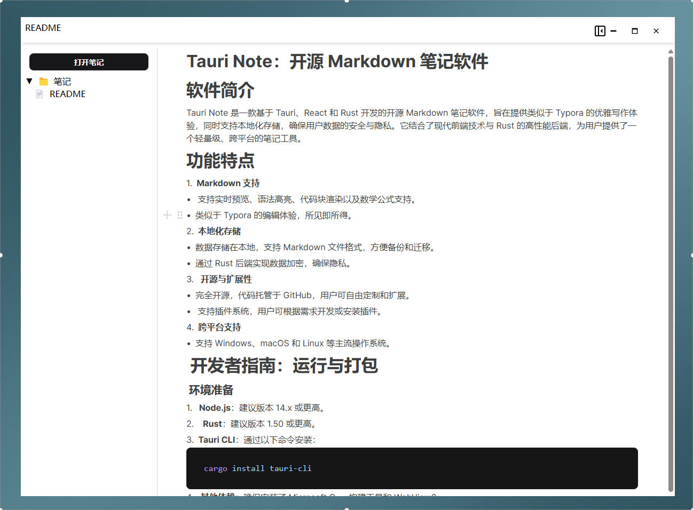
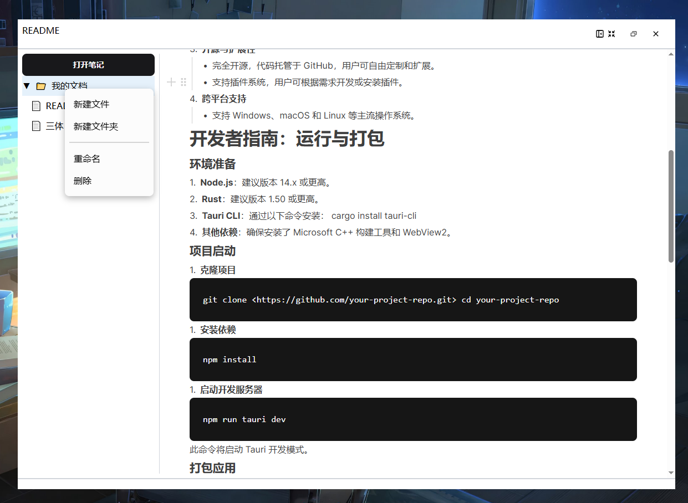
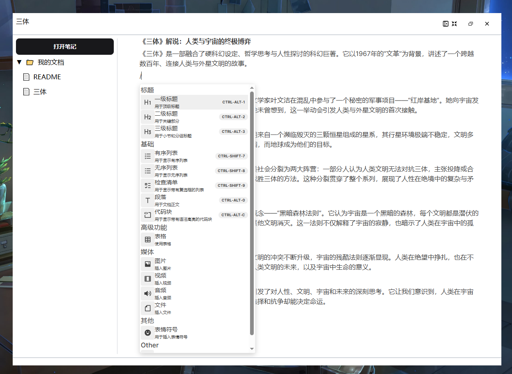

# **Tauri Note - 开源 Markdown 笔记软件**

## **软件简介**

Tauri Note 是一款基于 Tauri、React 和 Rust 开发的开源 Markdown 笔记软件，旨在提供类似于 Typora 的优雅写作体验，同时支持本地化存储，确保用户数据的安全与隐私。它结合了现代前端技术与 Rust 的高性能后端，为用户提供了一个轻量级、跨平台的笔记工具。

## **功能特点**

### **1. 强大的编辑体验**

- **块级编辑器**：基于 Tiptap 的仿 Notion 块级编辑器，支持丰富的编辑功能
- **快捷菜单**：使用 "/" 唤起命令菜单，快速插入各类内容块
- **所见即所得**：实时预览编辑效果，无需切换模式
- **语法高亮**：支持多种编程语言的代码块语法高亮
- **数学公式**：支持 LaTeX 数学公式编辑和渲染

### **2. 文件管理**

- **树形目录**：直观的文件夹和文件树形结构
- **右键菜单**：通过右键菜单快速创建、重命名或删除笔记
- **多格式支持**：支持 .md、.html、.txt、.json 和 .tn 格式文件
- **智能模板**：新建文件时自动生成适合的文件模板

### **3. 导出功能**

- **Markdown 导出**：将笔记导出为标准 Markdown 文件
- **HTML 导出**：导出为美观的 HTML 文件，包含样式
- **一键导出**：简单的操作流程，支持自定义文件名

### **4. 安全与隐私**

- **本地存储**：所有数据存储在本地，无需担心云服务隐私问题
- **文件加密**：通过 Rust 后端实现数据安全存储
- **无需联网**：完全离线工作，保护您的创作隐私

### **5. 跨平台支持**

- **多系统兼容**：支持 Windows、macOS 和 Linux 等主流操作系统
- **一致体验**：在不同平台上提供统一的用户界面和功能

## **界面展示**

### **主界面**



### **文件管理**



- 点击顶部可以展开收起文件夹目录
- 鼠标移动到文件夹然后**鼠标右键**可以创建或者删除笔记

### **编辑器**



- 编辑器使用 "/" 唤起菜单
- 基于 Tiptap 的仿 Notion 块级编辑器，支持自定义功能

## **技术架构**

### **前端技术栈**

- **React**：UI 构建基础框架 (v18.3)
- **TypeScript**：提供类型安全的代码编写体验
- **Tiptap/BlockNote**：强大的块级编辑器引擎
- **Tailwind CSS**：实用优先的 CSS 框架
- **Ant Design**：提供美观的 UI 组件
- **Vite**：现代前端构建工具，提供快速的开发体验

### **后端技术栈**

- **Tauri**：构建跨平台桌面应用的框架
- **Rust**：高性能、安全的系统编程语言
- **文件系统 API**：提供本地文件读写、目录管理功能
- **Tauri 插件**：dialog、opener 等扩展功能

### **核心功能实现**

- **文件树管理**：使用 Rust 实现文件系统遍历和过滤
- **文件操作**：创建、读取、更新、删除文件的 Rust 实现
- **内容导出**：支持 HTML 和 Markdown 格式导出
- **窗口控制**：最小化、最大化、关闭等窗口操作

### **数据流**

1. 用户在前端界面操作
2. React 组件触发 Tauri API 调用
3. Tauri 将请求传递给 Rust 后端处理
4. Rust 执行文件系统操作并返回结果
5. 前端接收结果并更新 UI

## **开发者指南**

### **环境准备**

1. **Node.js**：建议版本 14.x 或更高
2. **Rust**：建议版本 1.50 或更高
3. **Tauri CLI**：通过以下命令安装：
   ```bash
   cargo install tauri-cli
   ```
4. **其他依赖**：确保安装了 Microsoft C++ 构建工具和 WebView2

### **项目启动**

1. **克隆项目**
   ```bash
   git clone https://github.com/your-project-repo.git
   cd your-project-repo
   ```

2. **安装依赖**
   ```bash
   npm install
   # 或使用 pnpm
   pnpm install
   ```

3. **启动开发服务器**
   ```bash
   npm run tauri dev
   # 或使用 pnpm
   pnpm tauri dev
   ```

### **打包应用**

```bash
npm run tauri build
# 或使用 pnpm
pnpm tauri build
```

## **更新日志**

### **v0.1.0 (初始版本)**

- 基础编辑器功能实现
- 文件树管理系统
- Markdown 和 HTML 导出功能
- 跨平台支持 (Windows, macOS, Linux)
- 基于 Tiptap 的块级编辑器
- 本地文件系统集成

## **贡献指南**

欢迎为 Tauri Note 做出贡献！您可以通过以下方式参与：

- 提交 Bug 报告或功能请求
- 改进文档
- 提交代码修复或新功能
- 分享使用体验和建议

## **许可证**

Tauri Note 是开源软件，遵循 [LICENSE](./LICENSE) 许可证发布。

## **总结**

Tauri Note 是一个结合了 Tauri、React 和 Rust 的开源 Markdown 笔记软件，支持本地化存储和跨平台使用。它提供了类似 Notion 的块级编辑体验，同时保持了轻量级和高性能的特点。无论您是需要一个简单的笔记工具，还是寻找一个功能丰富的 Markdown 编辑器，Tauri Note 都能满足您的需求。
